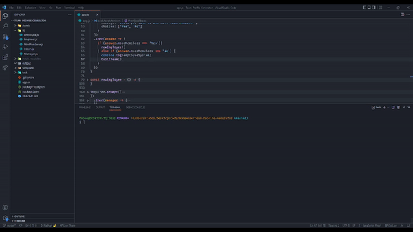

# Team Profile Generator

  

***
  ## Table of Contents
  - [Description](#description)
  - [Visual Presentation](#visual-presentation)
  - [Technologies Used](#technologies-used)
  - [Installation](#installation)
  - [Usage](#usage)
  - [Contribution](#contribution)
  - [Testing](#testing)
  - [Additional Info](#additional-info)

***
  ## Description
  Generate a profile page for your team in seconds with this generator app! Simply input your teams information and  watch as your webpage is generated before your eyes!

***
  ## Technologies Used

The technologies used in this project are Node, inquirer and fs-extra.

***
  ## Visual Presentation
  

***
  ## Installation
  Download via GitHub and run the package requirements.

***
  ## Usage
  Building a team profile page for your project or company.

***
  ## Contribution
  N/A

***
  ## Testing
  N/A

***
  ## Additional Info
  - Deplayed Page: https://tabuhana.github.io/Team-Profile-Generator/
  - Github: TabuHana(https://github.com/TabuHana)
  - Email: nate31196@outlook.com
